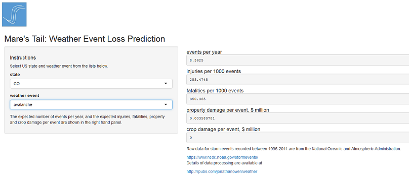

## Average annual losses due weather events between 1996-2011

*   Property damage $22.9 billion 
*   Crop damage $2.2 billion
*   Injuries 3620
*   Fatalities 550

source  
[National Oceanic and Atmospheric Administration] (https://www.ncdc.noaa.gov/stormevents/)

--- .class #id 

## Advanced knowledge allows preparation

### The old way  

<i>Mare's tails and mackerel scales make tall ships take in their sails</i>

<i>Red Sky at night, sailor's delight. Red sky in the morning, sailor take warning</i>

--- .class #id 

## Advanced knowledge allows preparation

### The new way  

Use historical data to create expected values for event frequency and losses by 
state and event type

*   number of events per year
*   injuries per 1000 events
*   fatalities per 1000 events
*   property damage per event
*   crop damage per event  

[RPub on data processing] (http://rpubs.com/jonathanowen/weather")

--- .class #id 

## Mare's Tail provides advanced knowledge to help preparation for weather events

[go to app](https://jonathanowen.shinyapps.io/DizzyPorcupine/)
